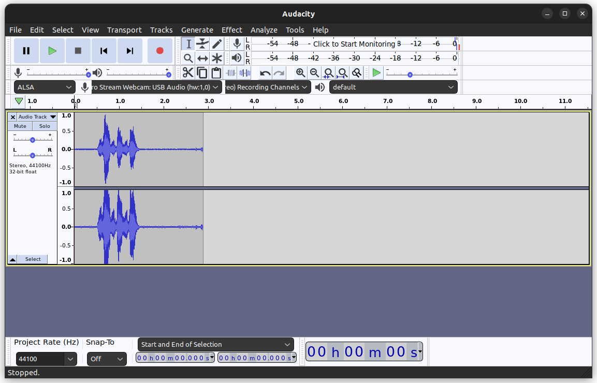

Precise
==============================
*A lightweight, simple-to-use, RNN wake word listener.*
#### Forked from https://github.com/MycroftAI/mycroft-precise, main as release branch, FengDev and Dev as develop branch

## Introduction
Precise is a wake word listener.  The software monitors an audio stream ( usually a microphone ) and when it recognizes a specific phrase it triggers an event.  For example, at Mycroft AI the team has trained Precise to recognize the phrase "Hey, Mycroft".  When the software recognizes this phrase it puts the rest of Mycroft's software into command mode and waits for a command from the person using the device.  Mycroft Precise is fully open source and can be trined to recognize anything from a name to a cough.

In addition to Precise there are several proprietary wake word listeners out there.  If you are looking to spot a wakeword Precise might be a great solution, but if it's too resource intensive or isn't accurate enough here are some [alternative options][comparison].

## Attentions And Motivations for this repo
1. The original [repo](https://github.com/MycroftAI/mycroft-precise) is out of maintenance, which means it requires some out of time packages such as tensorflow 1.x, makes precise hard to Integrate into new projects.
2. The original mycroft-precise need to be installed into your python env, but it just copies the scripts into bin dir without file extension '*.py' and make aliases for its. This has no advantages other than making debugging more complicated.
3. To revive this great project, I fork it and try to add some new ideas.

## usage
### setup requirements
1. now we just tested on ubuntu 22.04, x86_64 with intel CPU. I cannot guarantee this repo can be executed correctly on other operating systems or arch.
2. prepare a conda env by `conda create -n precise python=3.9` and activate it by `conda activate precise`
3. install apt packages by
    ```shell
    sudo apt-get update && sudo apt-get install -y libopenblas-dev libhdf5-dev portaudio19-dev
    ```
4. install pip packages by `pip install -r requirements.txt`

### training your own model
1. record audio files
    The first thing you'll want to do is record some audio samples of your wake word. To do that, use the tool, precise-collect, which will guide you through recording a few samples. The default settings should be fine.

    Use this tool to collect around 12 samples, making sure to leave a second or two of silence at the start of each recording, but with no silence after the wake word.
    ```shell
    $ cd <repo>/precise/scripts 
    $ python collect.py
    Audio name (Ex. recording-##): hey-computer.##
    ALSA lib pcm_dsnoop.c:638:(snd_pcm_dsnoop_open) unable to open slave
    ALSA lib pcm_dmix.c:1099:(snd_pcm_dmix_open) unable to open slave
    ALSA lib pcm_dmix.c:1099:(snd_pcm_dmix_open) unable to open slave
    Press space to record (esc to exit)...
    Recording...
    Saved as hey-computer.00.wav
    Press space to record (esc to exit)...
    ```
   you can also use GUI tool named 'Audacity' to record audio and edit it.
    
2. audio file pre-process
    Audio files we need as training data must be WAV files in little-endian, 16 bit, mono, 16000hz PCM format. FFMpeg calls this “pcm_s16le”. If you are collecting samples using another program they must be converted to the appropriate format using an ffmpeg command:
    ```shell
    $ ffmpeg -i input.mp3 -acodec pcm_s16le -ar 16000 -ac 1 output.wav
    ```
3. prepare training data set
    the dir structure must like this, dataloader will read the strings 'wake-word', 'not-wake-word' and 'test'.
    ```shell
    ├── data
    │   ├── not-wake-word
    │   │   ├── f0001.wav
    │   │   ├── f0002.wav
    │   │   ├── f0003.wav
    │   │   └── f0004.wav
    │   └── wake-word
    │       ├── t001.wav
    │       ├── t002.wav
    │       ├── t003.wav
    │       ├── t004.wav
    │       ├── t005.wav
    │       ├── t006.wav
    │       ├── t007.wav
    │       ├── t008.wav
    │       └── test              
    │           ├── not-wake-word 
    │           │   ├── f0001.wav 
    │           │   ├── f0002.wav 
    │           │   ├── f0003.wav 
    │           │   └── f0004.wav 
    │           └── wake-word     
    │               ├── t001.wav  
    │               ├── t002.wav  
    │               ├── t003.wav  
    │               └── t004.wav  
   ```
4. training
    run this script to start training: 
    ```shell
    cd <repo>/precise/scripts  
    python train.py -e 60 <path to save model>/hi_siri.net <path to dataset>data/
    ```
   std out will be:
    ```shell
    Data: <TrainData wake_words=8 not_wake_words=4 test_wake_words=4 test_not_wake_words=4>
    Loading wake-word...
    Loading not-wake-word...
    Loading wake-word...
    Loading not-wake-word...
    Inputs shape: (12, 29, 13)
    Outputs shape: (12, 1)
    Test inputs shape: (8, 29, 13)
    Test outputs shape: (8, 1)
    Model: "sequential"
    _________________________________________________________________
     Layer (type)                Output Shape              Param #   
    =================================================================
     net (GRU)                   (None, 20)                2100      
                                                                     
     dense (Dense)               (None, 1)                 21        
                                                                     
    =================================================================
    Total params: 2121 (8.29 KB)
    Trainable params: 2121 (8.29 KB)
    Non-trainable params: 0 (0.00 Byte)
    _________________________________________________________________
    Epoch 1/60
    1/1 [==============================] - 1s 1s/step - loss: 1.3249 - accuracy: 0.6667 - val_loss: 1.4658 - val_accuracy: 0.5000
    Epoch 2/60
    1/1 [==============================] - 0s 494ms/step - loss: 1.1082 - accuracy: 0.6667 - val_loss: 1.2408 - val_accuracy: 0.5000
    ```
### run a simple test

============ old readme below ==============

[comparison]: https://github.com/MycroftAI/mycroft-precise/wiki/Software-Comparison

## Supported Operating Systems

Precise is designed to run on Linux.  It is known to work on a variety of Linux distributions including Debian, Ubuntu and Raspbian.  It probably operates on other \*nx distributions.

## Training Models

### Communal models

Training takes lots of data. The Mycroft community is working together to jointly
build datasets at: 
https://github.com/MycroftAI/precise-community-data.   
These datasets are available for anyone to download, use and contribute to. A number 
of models trained from this data are also provided.

The official models selectable in your device settings at Home.mycroft.ai 
[can be found here](https://github.com/MycroftAI/precise-data/tree/models).  

Please come and help make things better for everyone!

### Train your own model

You can find info on training your own models [here][train-guide]. It requires
running through the [**source install instructions**][source-install] first.

[train-guide]:https://github.com/MycroftAI/mycroft-precise/wiki/Training-your-own-wake-word#how-to-train-your-own-wake-word
[source-install]:https://github.com/MycroftAI/mycroft-precise#source-install

## Installation

If you just want to use Mycroft Precise for running models in your own application,
you can use the binary install option. Note: This is only updated to the latest release,
indicated by the latest commit on the master branch. If you want to train your own models
or mess with the source code, you'll need to follow the **Source Install** instructions below.

### Binary Install

First download `precise-engine.tar.gz` from the [precise-data][precise-data] GitHub
repo. This will get the latest stable version (the master branch). Note that this requires the models to be built the the same latest version in the master branch. Currently, we support both 64 bit Linux desktops (x86_64) and the Raspberry Pi (armv7l).

[precise-data]: https://github.com/mycroftai/precise-data/tree/dist

Next, extract the tar to the folder of your choice. The following commands will work for the pi:

```bash
ARCH=armv7l
wget https://github.com/MycroftAI/precise-data/raw/dist/$ARCH/precise-engine.tar.gz
tar xvf precise-engine.tar.gz
```

Now, the Precise binary exists at `precise-engine/precise-engine`.

Next, install the Python wrapper with `pip3` (or `pip` if you are on Python 2):

```bash
sudo pip3 install precise-runner
```

Finally, you can write your program, passing the location of the precise binary like shown:

```python
#!/usr/bin/env python3

from precise_runner import PreciseEngine, PreciseRunner

engine = PreciseEngine('precise-engine/precise-engine', 'my_model_file.pb')
runner = PreciseRunner(engine, on_activation=lambda: print('hello'))
runner.start()

# Sleep forever
from time import sleep
while True:
    sleep(10)
```

### Source Install

Start out by cloning the repository:

```bash
git clone https://github.com/mycroftai/mycroft-precise
cd mycroft-precise
```

If you would like your models to run on an older version of precise, like the
stable version the binary install uses, check out the master branch.

Next, install the necessary system dependencies. If you are on Ubuntu, this
will be done automatically in the next step. Otherwise, feel free to submit
a PR to support other operating systems. The dependencies are:

 - python3-pip
 - libopenblas-dev
 - python3-scipy
 - cython
 - libhdf5-dev
 - python3-h5py
 - portaudio19-dev

After this, run the setup script:

```bash
./setup.sh
```

Finally, you can write your program and run it as follows:
```bash
source .venv/bin/activate  # Change the python environment to include precise library
```
Sample Python program:
```python
#!/usr/bin/env python3

from precise_runner import PreciseEngine, PreciseRunner

engine = PreciseEngine('.venv/bin/precise-engine', 'my_model_file.pb')
runner = PreciseRunner(engine, on_activation=lambda: print('hello'))
runner.start()

# Sleep forever
from time import sleep
while True:
    sleep(10)
```

In addition to the `precise-engine` executable, doing a **Source Install** gives you
access to some other scripts. You can read more about them [here][executables].
One of these executables, `precise-listen`, can be used to test a model using
your microphone:

[executables]:https://github.com/MycroftAI/mycroft-precise/wiki/Training-your-own-wake-word#how-to-train-your-own-wake-word

```bash
source .venv/bin/activate  # Gain access to precise-* executables
precise-listen my_model_file.pb
```

## How it Works

At it's core, Precise uses just a single recurrent network, specifically a GRU.
Everything else is just a matter of getting data into the right form.


